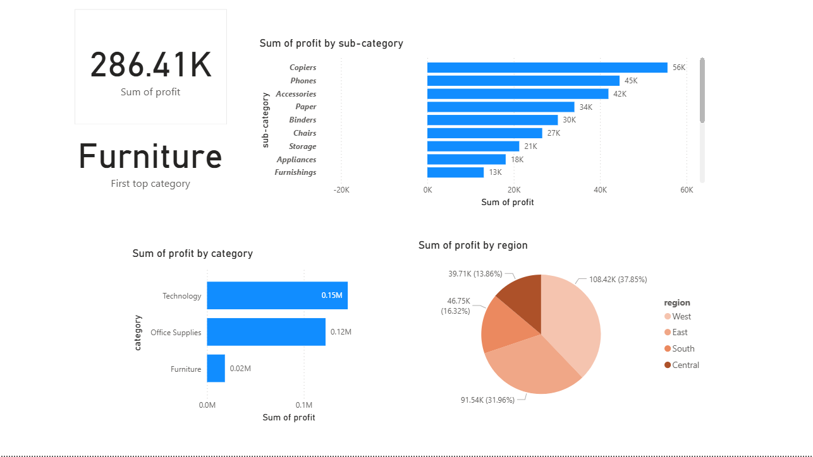

# ETL-Sales-Insights-Dashboard

### 🧠 Sales Performance Dashboard — Power BI + MySQL + Python
### 📊 Project Overview

This is a practice project where I built a Sales Performance Dashboard using Power BI connected to a MySQL database. The main idea was to get hands-on experience with a simple ETL (Extract, Transform, Load) workflow — cleaning data in Python, storing it in MySQL, and creating interactive dashboards in Power BI.
It’s meant as a learning exercise to simulate the kind of data workflows a Data Engineer or Analyst might encounter in real life.
It’s designed to simulate a real-world data workflow that a Data Engineer or Analyst would perform.

# ⚙️ Tech Stack
-> Python → Data cleaning and preprocessing (using pandas)

-> MySQL → Data storage and querying

-> Power BI → Data visualization and dashboard creation

# 📦 ETL-SALES-INSIGHTS-DASHBOARD
 ┣ 📁 data/
 
 ┃ ┗ superstore.csv
 
 ┣ 📁 script/
 
 ┃ ┗ main.py/
 
 ┃ ┗ create_view.sql
 
 ┣ 📁 powerbi/
 
 ┃ ┗ SalesDashboard.pbix 
 
 ┣ 📄 requirements.txt  
 
 ┣ 📄 README.md                

# 🚀 Setup Instructions
1️⃣ Clone the Repository\
git clone https://github.com/<your-username>/sales-performance-dashboard.git\
cd sales-performance-dashboard

2️⃣ Install Python Dependencies\
pip install -r requirements.txt

3️⃣ Load the Data into MySQL\
Create a MySQL database named etl_project
Run your MySQL server
Execute the Python script:
python scripts/clean_sales_data.py

4️⃣ Connect Power BI to MySQL\
Open Power BI Desktop\
Click Get Data → MySQL Database\
Enter your MySQL credentials\
(Host: localhost, Database: sales_db)\
Load the data and explore the dashboard

# 📈 Dashboard Features
✅ Total Sales & Profit Overview\
✅ Top Performing Products\
✅ Regional Sales Breakdown

# PREVIEW

